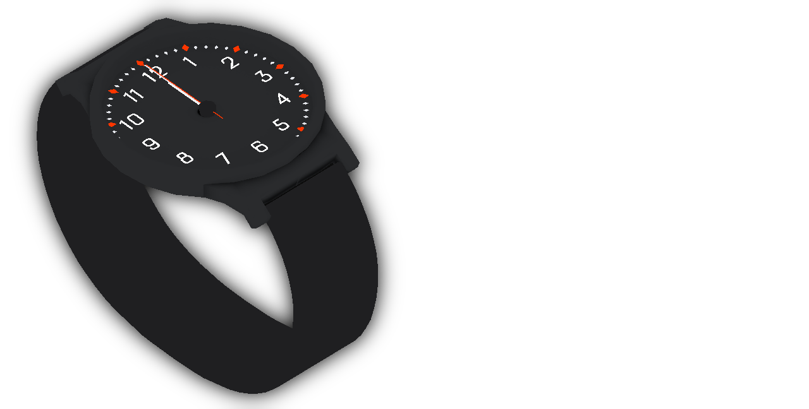
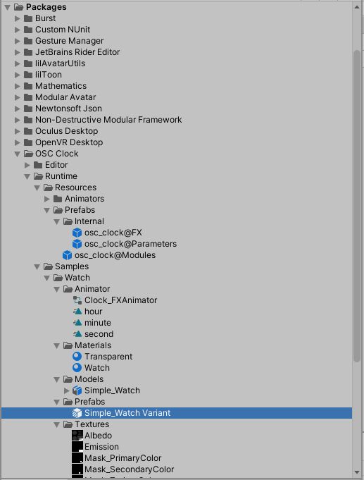
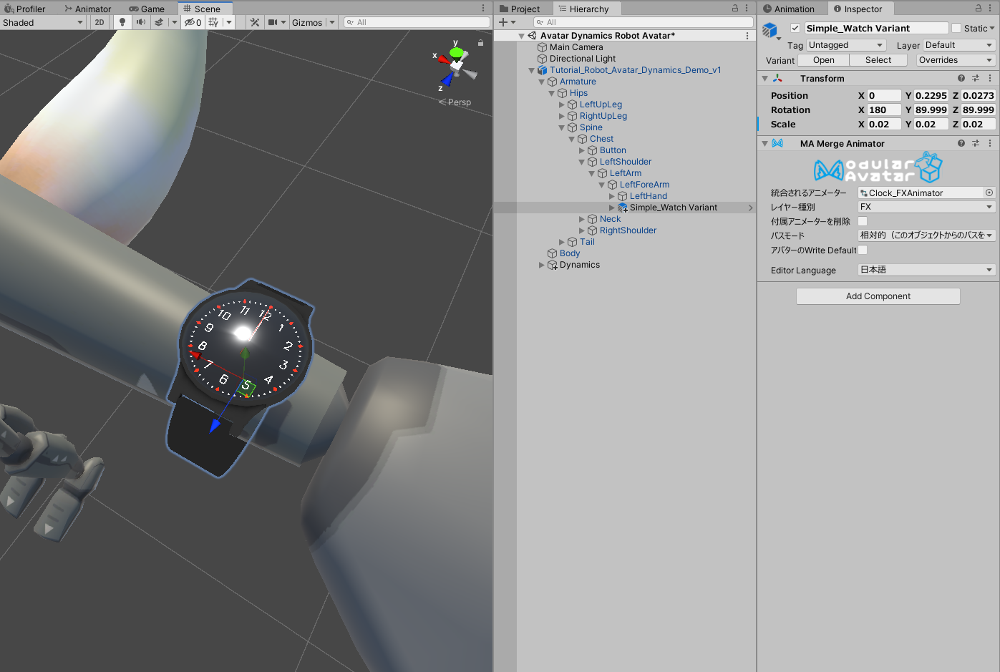
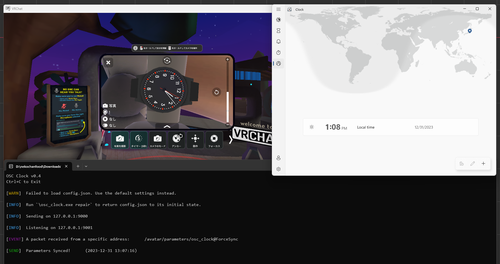

# サンプルアセット

OSC Clock のリソース内にはサンプルアセットの腕時計が付属しています！

このアセットを使用して、OSC Clock がどのように動作するか、試すことができます。

リソースをプロジェクトに追加する方法は、[ここ](/docs/welcome#リソースをインストールする)を参照してください。

## アバターに追加する

OSC Clock のリソースフォルダは`Assets`ではなく、`Packages`フォルダ内にあります！

`Packages/OSC_Clock/Runtime/Samples/Watch/Prefabs`内にある`Simple_Watch Variant`をアバターの腕に追加します。

小さすぎたり、大きすぎる場合は、Position, Rotation, Scaleを調整してもかまいません。

後はアバターを新規でアップロードして、[プログラム](/docs/welcome#プログラムをダウンロードする)といっしょにVRChatを起動して、アバターを着ると時計が動きます。

