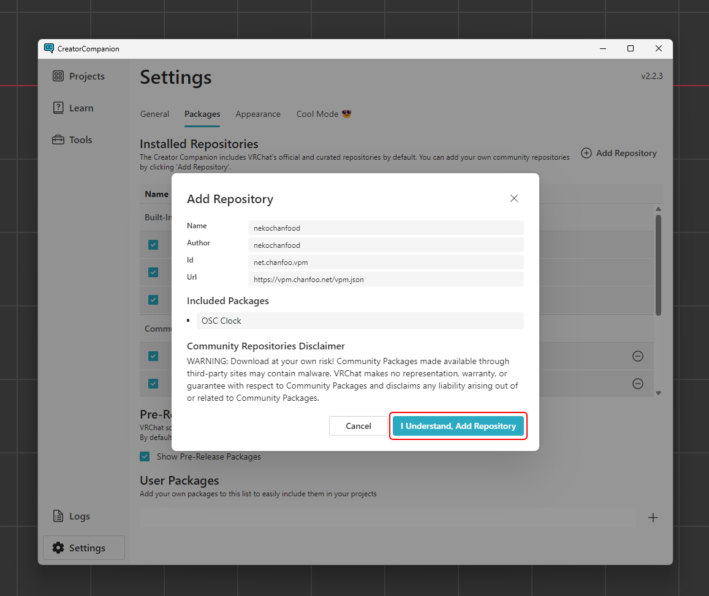
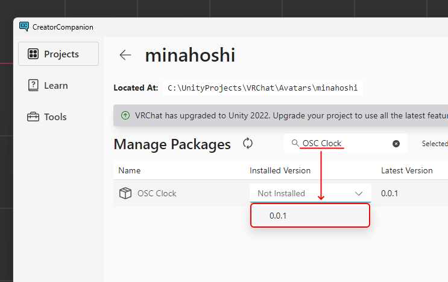

# ようこそ

OSC Clock の使い方や説明を集めたドキュメントサイトです。

## OSC Clock とは？

OSC Clock はOSCを通して日付と時刻を VRChat に送信するプログラムです。

これを使うことで、正確な時間を表示する腕時計を簡単に作成することができます。

## プログラムをダウンロードする

[https://github.com/nekochanfood/osc_clock/releases](https://github.com/nekochanfood/osc_clock/releases/latest) から、最新版の OSC Clock をダウンロードすることができます。

## リソースをインストールする

:::danger
OSC Clock のリソースのほとんどは、Modular Avatarを使用しているため、このリソースを使用するにはプロジェクトに Modular Avatar がインストールされている必要があります。

[ここ](https://modular-avatar.nadena.dev/ja/docs/intro)の手順に従って、Modular Avatarをインストールしてください。
:::

[ここ](vcc://vpm/addRepo?url=https://vpm.chanfoo.net/vpm.json)をクリックして、VCC に OSC Clock のレポジトリを追加します。

"I understand, Add Repository" をクリックして、レポジトリを追加します。

インストールしたいプロジェクトの管理画面を開き、"OSC Clock"と書かれているパッケージの "+" か、ドロップダウンから最新のバージョンをクリックしてインストールします。

